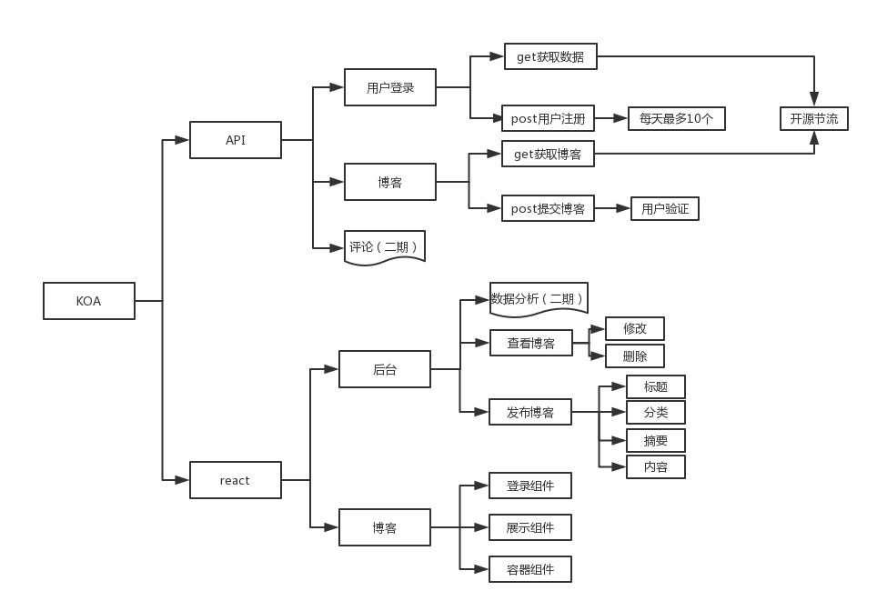

# blog_server

我把我的静态博客搬到我的腾讯云服务器上面了,网址是:[http://111.231.244.144:3000/](http://111.231.244.144:3000/)

PS:用360浏览器会有鼠标与视图不对位的bug,用chrome和手机浏览器就不会了,目前还不知道原因是什么.

## TODO

### 知识储备

- [x] 学习koa搭建jsonp和restful接口
- [x] 学习koa中mongoose的增删改查
- [x] 学习前后端路由相结合
- [x] 复习react并用react写一个todo
- [x] 用react-redux写一个todo
- [x] 用react-redux + router写一个todo
- [x] 给todo添加redux-thunk进行异步获取数据

### 重构博客

- [x] 画出基本的架构图
- [x] 搭建好前后端框架和文件架构
- [x] koa写入blog api
- [ ] koa写入user api
- [ ] static写入后台管理系统
- [ ] static写入博客系统
- [ ] 开发二期
- [ ] 服务端渲染
- [ ] 开发react native app

### 后续处理

- [ ] 去掉端口3000.
- [ ] 搞个后台.打算用egg + mongoose
- [ ] 换个https协议
